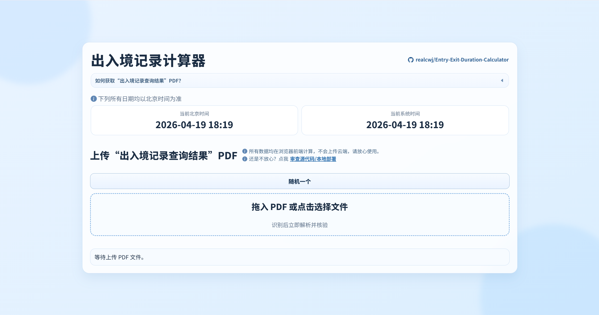
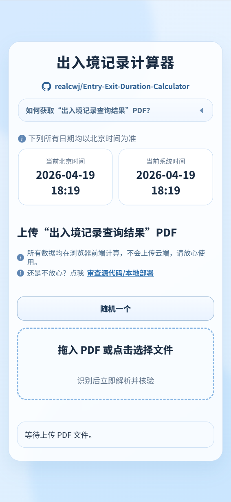
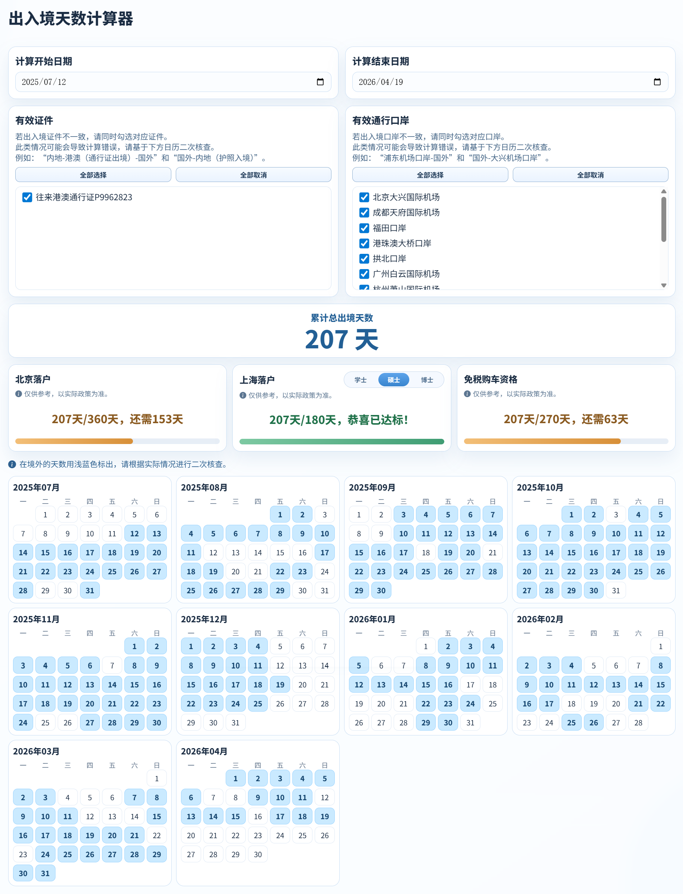
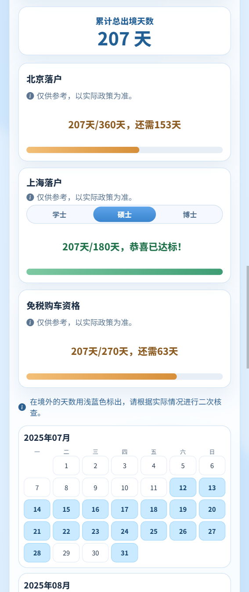
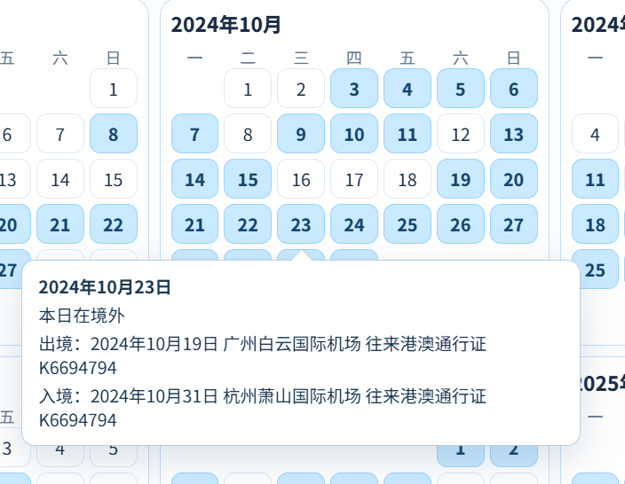

# 留学生出入境记录计算器

一个纯前端 HTML/JavaScript 实现的适用中国留学生的出境天数计算工具，可解析国家移民局的“出入境记录查询结果”PDF，支持复杂场景的核验与计算，帮助留学生核算京沪落户、免税购车等资格。

> 索引词：中国留学生出入境记录计算器、国家移民局、出入境记录查询结果、留学生落户资格、北京落户、上海落户、免税购车资格、出境天数计算、PDF 解析、前端工具

## 功能展示

  
  
  
  
  

## 核心特点

- 🧠 支持本地解析：所有解析与计算均在浏览器本地完成，不上传云端。
- 🔁 兼容特殊场景：支持港澳地区留学生当日往返、当日多次往返、跨日往返等复杂场景。
- 🕒 处理时间一致：解析、筛选、计算、展示统一按北京时间处理，避免部分留学生设备时间为境外时间产生计算错误。
- 🗓️ 离境日可视化：根据日历月历逐日展示离境的每一天，便于二次核查。
- 🧩 证件/口岸筛选：支持按日期范围、证件、口岸过滤出入境记录，排除留学过程中出境旅游的时间。
- ⚠️ 异常判断处理：支持识别“无最早出境记录”“无最晚入境记录”等场景并给出处理选项。
- 🧾 Json 数据导出：支持导出解析后的 JSON 数据，便于二次复核。

## 使用方法

在线使用：[>>>点我访问在线版本<<<](https://realcwj.github.io/Entry-Exit-Duration-Calculator/)

1. 下载本项目：含 index.html（主页面）、styles.css（样式表）、app.js（功能脚本）。
2. 打开页面：index.html。
3. 上传“出入境记录查询结果”PDF（拖拽或点击）。
4. 通过核验后，设置开始/结束日期。
5. 勾选有效证件与口岸（可“全部选择/全部取消”）。
6. 查看：
	 - 累计总出境天数；
	 - 月历高亮；
	 - 资格进度。

## 文件功能说明

- index.html：页面结构与组件容器
- styles.css：界面样式与响应式布局
- app.js：PDF 解析、核验、筛选、计算、日历渲染、异常处理

## 常见问题

### 1) 会上传我的 PDF 吗？
不会。默认逻辑均在浏览器本地执行。

### 2) 解析失败/结果不对怎么办？如何反馈Bug？
请 [>>>点我给作者发送邮件<<<](mailto:wenjun.chen.personal@outlook.com)，提供 PDF 样本和报错复现方法，帮助改进算法。

**作者承诺不会泄露任何个人隐私信息。** 您也可以编辑出入境记录PDF，删除敏感信息后再发送给作者。

## 免责声明

本工具仅用于辅助核算与自查，不能替代官方政策解释。请以官方最近政策材料为准。
